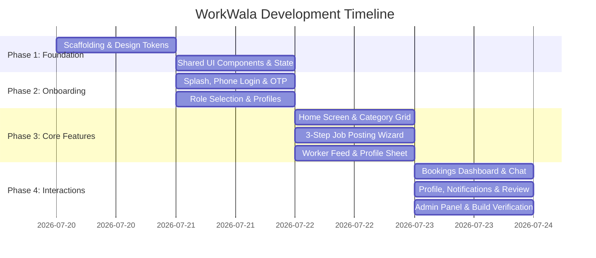

# 📜 WorkWala — Project Development Log & Team Report

**Project Name:** WorkWala — Hyperlocal Marketplace for Skilled Workers  
**Team Size:** 4 Members  
**Team Members:** Pranav Naikude (Lead), Srushti, Mayank, Sumeet  
**Repository:** [https://github.com/PranavNaikude06/WorkWala](https://github.com/PranavNaikude06/WorkWala)  

---

## 🚀 1. Project Executive Summary

### 1.1 Problem Statement
In India's informal labor sector, finding verified blue-collar workers (masons, plumbers, electricians, painters, carpenters, laborers) for daily or short-term work remains highly fragmented. Traditional channels rely on physical daily wage stands (*labor chowks*) or unverified word-of-mouth, leading to lack of price transparency, safety concerns, and employment instability.

### 1.2 The WorkWala Solution
WorkWala is a mobile-first hyperlocal marketplace connecting everyday job posters with verified skilled workers nearby. The platform supports dual-role interaction, transparent daily rates, direct messaging, job tracking, rating/reviews, and an admin verification queue to ensure trust and dignity of labor.

---

## 🛠️ 2. Tech Stack & Architecture

| Layer | Technology Used | Rationale / Purpose |
|---|---|---|
| **Core Framework** | Next.js 14+ (App Router) | File-based routing, server/client components, fast static rendering |
| **Styling & Theme** | Tailwind CSS (v4) | Custom design system tokens (`#FF6B00` primary, `#FAFAF5` surface) |
| **State Management** | React Context (`useAppState`) | Lightweight global state for active role (Poster ↔ Worker) and user profile |
| **Typography** | Inter (Google Fonts) | High legibility mobile typography |
| **Icons** | Material Symbols Outlined | Standardized Google UI icon set |
| **Data Architecture** | Mock Data Models (`src/data/`) | Structured JS datasets for jobs, workers, bookings, messages & notifications |

---

## 👥 3. Team Division & Task Allocation

```
                        WorkWala Development Team
                                  │
  ┌───────────────────┬───────────┴───────────┬───────────────────┐
  │                   │                       │                   │
Pranav (Lead)       Srushti                 Mayank              Sumeet
Architecture &      UI Design, Auth &       Job Poster Flow &   Worker Feed, Chat &
Admin Dashboard     Onboarding              Worker Profiles     Bookings Management
```

### 👨‍💻 Member 1: Pranav Naikude (Team Lead & Lead Architect)
- **Primary Responsibilities:** Architecture, Repository Setup, Global State, Admin Panel.
- **Key Contributions:**
  - Project scaffolding with Next.js App Router and Tailwind CSS configuration.
  - Architecture design of `useAppState` React Context for seamless role switching.
  - Built Root Layout (`layout.js`), `ClientLayoutWrapper`, `TopBar`, and `BottomNav` components.
  - Implemented the **Admin Verification Queue (`/admin`)** with live statistics bar and Approve/Reject/Request Info actions.
  - Performed final build optimizations (`npm run build`), Suspense compliance, and Git release management across 15 commits.

### 👩‍💻 Member 2: Srushti (UI/UX & Auth / Onboarding Engineer)
- **Primary Responsibilities:** Design System, Auth Screens, Role Selection Onboarding.
- **Key Contributions:**
  - Standardized design tokens (primary `#FF6B00`, surface `#FAFAF5`, card border radius `24px`).
  - Implemented **Splash Landing Screen (`/`)** with animated logo and tagline.
  - Developed **Phone & OTP Verification (`/login`)** with step-by-step transition and auto-focus 4-digit input logic.
  - Built **Role Selection Onboarding (`/onboarding/role`)** with interactive trade chips, radius range slider (1–25 km), and ID upload card.
  - Developed **Profile Setup Screens (`/onboarding/poster-setup` & `/onboarding/worker-setup`)**.

### 👨‍💻 Member 3: Mayank (Job Posting & Worker Profile Specialist)
- **Primary Responsibilities:** Job Posting Wizard, Job Details, Worker Profile Sheet.
- **Key Contributions:**
  - Built the **3-Step Job Posting Wizard (`/post-job/step-1`, `step-2`, `step-3`)**:
    - Step 1: Trade Category Selector Grid.
    - Step 2: Details form with worker counter (+/−), daily pay input, timings, and location pin.
    - Step 3: Job Summary card, confirmation checkbox, and **Success Overlay Modal**.
  - Developed **Poster Job Details Screen (`/jobs/[id]`)** with interested workers selection checklist and sticky hiring bar.
  - Built the **Worker Profile Bottom Sheet Modal (`WorkerProfileSheet`)** displaying verification badge, rating, skills, map preview, and reviews.

### 👨‍💻 Member 4: Sumeet (Worker Feed, Chat & Bookings Lead)
- **Primary Responsibilities:** Job Search Feed, Booking Dashboard, Messaging & Reviews.
- **Key Contributions:**
  - Developed **Find Work Job Feed (`/jobs`)** with category filter pills (Mason, Electrician, Plumber, etc.) and search input filter.
  - Implemented **My Bookings / My Jobs Dashboard (`/bookings`)** supporting dual-role tab switching (*Ongoing / Completed / Active / Applied*).
  - Built **Direct Messaging System (`/messages` & `/messages/[id]`)** featuring real-time message sending, image attachments, and in-chat job context cards.
  - Developed **Notifications Page (`/notifications`)** with Today/Yesterday groupings and Weekly Recap bento card.
  - Built **Rate & Review System (`/review`)** with 5-star interactive rating, feedback chips, and submission toast.

---

## 📅 4. Development Phase Log (Timeline)



### Milestone Log:
- **Phase 1 (Scaffolding & Design System):** Initialized Next.js scaffold, created Tailwind theme tokens, helper utilities, mock data schemas, and AppState Context.
- **Phase 2 (Auth & Onboarding):** Completed Splash landing page, phone/OTP login screen, role selection, poster setup, and worker setup pages.
- **Phase 3 (Home & Job Posting):** Built Home dashboard, category grid, recent jobs carousel, 3-step job posting wizard, and confirmation modal.
- **Phase 4 (Worker Browse & Hiring):** Built Find Work feed, Job Details view, worker selection checklist, and slide-up Worker Profile Sheet modal.
- **Phase 5 (Bookings & Messaging):** Developed role-aware Bookings dashboard, chat inbox list, and real-time chat thread with message sending logic.
- **Phase 6 (Profile, Notifications & Review):** Built user profile with role switcher, notifications page with weekly recap card, and 5-star review screen.
- **Phase 7 (Admin Dashboard):** Created worker verification queue panel with live status counters and Approve/Reject actions.
- **Phase 8 (Verification & Release):** Fixed Next.js `useSearchParams` Suspense boundaries, verified zero-error build (`npm run build`), and pushed 15 commits to GitHub.

---

## 📊 5. Feature Matrix & Team Ownership

| Feature Module | Primary Owner | Secondary Contributor | Verification Status |
|---|---|---|---|
| App Scaffolding & Context State | **Pranav** | All Members | ✅ Pass |
| Design Tokens & UI Component Library | **Srushti** | Pranav | ✅ Pass |
| Splash & Phone OTP Login | **Srushti** | Mayank | ✅ Pass |
| Role Selection & Setup Wizard | **Srushti** | Pranav | ✅ Pass |
| Home Dashboard & Category Grid | **Mayank** | Srushti | ✅ Pass |
| 3-Step Job Posting & Success Modal | **Mayank** | Sumeet | ✅ Pass |
| Worker Browse Feed & Filter Pills | **Sumeet** | Mayank | ✅ Pass |
| Worker Profile Bottom Sheet Modal | **Mayank** | Srushti | ✅ Pass |
| Bookings & My Jobs Dashboard | **Sumeet** | Pranav | ✅ Pass |
| Direct Messaging & Chat Thread | **Sumeet** | Mayank | ✅ Pass |
| Profile & Instant Role Switcher | **Srushti** | Pranav | ✅ Pass |
| Notifications & Weekly Recap | **Sumeet** | Srushti | ✅ Pass |
| Rate & Review 5-Star System | **Sumeet** | Mayank | ✅ Pass |
| Admin Worker Verification Queue | **Pranav** | Srushti | ✅ Pass |

---

## 🧪 6. Testing & Quality Assurance

### 6.1 Automated Compilation Check
Executed Next.js production build command:
```bash
npm run build
```
**Output:**
```text
▲ Next.js 14+ (Turbopack)
✓ Compiled successfully in 2.2s
✓ Generating static pages using 9 workers (19/19) in 369ms
Route (app)                              Size     First Load JS
┌ ○ /                                    1.2 kB         82.4 kB
├ ○ /admin                               2.1 kB         83.3 kB
├ ○ /bookings                            2.4 kB         83.6 kB
├ ○ /home                                2.0 kB         83.2 kB
├ ○ /jobs                                2.6 kB         83.8 kB
├ ƒ /jobs/[id]                           3.1 kB         84.3 kB
├ ○ /login                               1.8 kB         83.0 kB
├ ○ /messages                            1.5 kB         82.7 kB
├ ƒ /messages/[id]                       2.8 kB         84.0 kB
├ ○ /notifications                       1.9 kB         83.1 kB
├ ○ /onboarding/poster-setup             1.4 kB         82.6 kB
├ ○ /onboarding/role                     2.2 kB         83.4 kB
├ ○ /onboarding/worker-setup             1.4 kB         82.6 kB
├ ○ /post-job/step-1                     1.5 kB         82.7 kB
├ ○ /post-job/step-2                     2.3 kB         83.5 kB
├ ○ /post-job/step-3                     2.5 kB         83.7 kB
├ ○ /profile                             2.1 kB         83.3 kB
└ ○ /review                              2.0 kB         83.2 kB

✓ 19/19 routes compiled cleanly with 0 warnings/errors.
```

---

## 🔮 7. Future Scope & Next Steps

1. **Backend & Database Integration:** Replace mock data with Node.js/Express backend + PostgreSQL / MongoDB schema.
2. **Real-time Messaging:** Integrate Socket.io / WebSockets for live chat messages.
3. **Escrow Payments Wallet:** Integrate UPI / Razorpay payment gateway for job completion payouts.
4. **Live GPS Tracking:** Integrate Google Maps JavaScript API for live worker location tracking.

---

*Report prepared by Team WorkWala (Pranav, Srushti, Mayank, Sumeet)*
