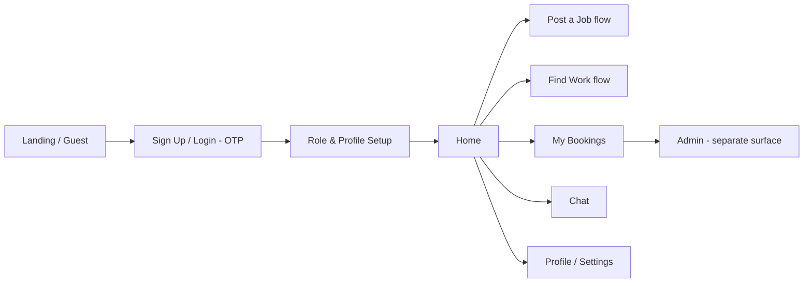
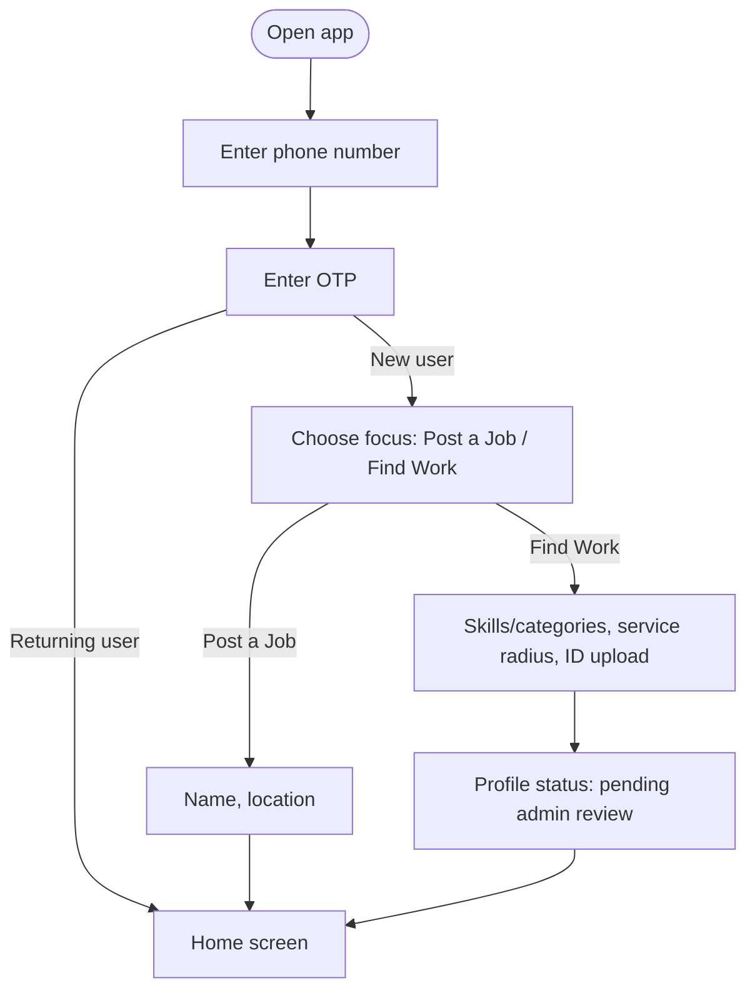
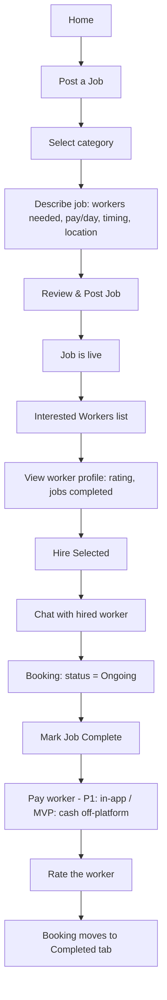
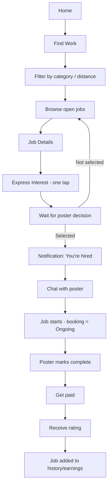
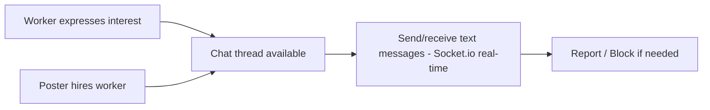
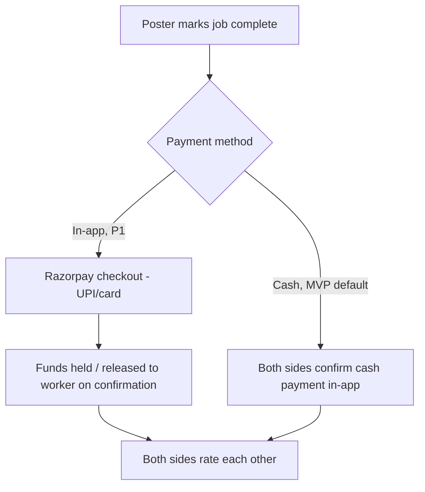
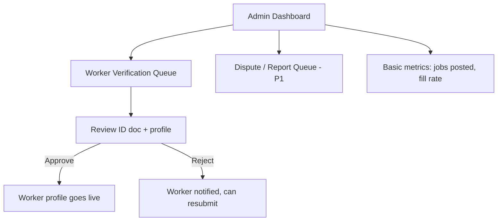
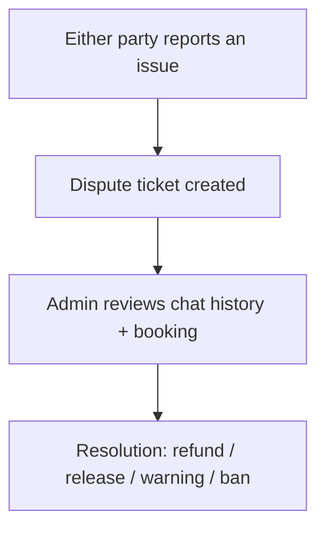

# WorkWala — App Flow Document

**Version:** v0.1
**Status:** Draft — paired with `prd.md` and `techstack.md`
**Scope:** MVP (P0) flows, with P1 flows (payments, notifications) noted where they attach

---

## 1. Actors

- **Guest** — not yet signed in
- **Job Poster** — posts jobs, hires, pays, rates
- **Worker** — browses jobs, expresses interest, gets hired, rated
- **Admin** — verifies workers, moderates, resolves disputes

Per the PRD's open question, a single account may hold both Poster and Worker roles — flows below are written per-role and can both live under one account.

---

## 2. High-Level App Map

---

## 3. Onboarding & Auth Flow

**Notes**
- Worker profiles enter a "pending" state until an Admin approves the uploaded ID — matches the Trust & Safety section of the PRD.
- Poster profiles are live immediately (lower risk side of the marketplace).

---

## 4. Home Screen (per reference design)

Matches the "Hello, [Name]! What do you need today?" screen:
- Two primary actions: **Post a Job** and **Find Work**
- **Popular Categories** grid (Laborer, Mason, Carpenter, Painter, Plumber, Electrician, Cleaning/Housekeeping, Loading/Unloading, More)
- **Recent Jobs** feed (visible to Workers; nearby open jobs with pay/day shown)
- Bottom nav: Home / Jobs / Post Job / Messages / Profile

---

## 5. Job Poster Flow

**Screen-by-screen (maps to reference mockups)**
1. **Post a Job** — category icon grid, "Describe your job" field, number of workers needed, work timing, notes (e.g., "lunch provided"), Post Job button.
2. **Job Details / Live** — job summary, posted-by + time-ago, description, timing, list of interested workers as they apply.
3. **Interested Workers** — cards per worker with name, star rating, jobs-completed count, "View Profile" and a multi-select "Hire Selected" action.
4. **My Bookings** — Ongoing / Completed / Cancelled tabs; each booking card shows job title, pay/day, start date, workers assigned, and a Chat shortcut.

---

## 6. Worker Flow

---

## 7. Chat Flow

Voice & video call is a P2 addition on top of this same thread (per PRD roadmap) — not in MVP scope.

---

## 8. Payment Flow (P1)

MVP ships "pay after work," settled off-platform (cash), per the original concept — the app simply tracks that a booking is completed. Razorpay in-app settlement is a Phase 1 addition once trust/volume justify it.

---

## 9. Notification Triggers

| Event | Recipient | Channel (MVP → P1) |
|---|---|---|
| New worker interested | Poster | In-app → Push (FCM) |
| Hired for a job | Worker | In-app → Push |
| Job starting soon | Both | In-app → Push |
| New chat message | Both | In-app → Push |
| Job marked complete | Both | In-app → Push |
| New rating received | Both | In-app → Push |
| Worker profile approved/rejected | Worker | In-app → Push |

---

## 10. Admin Flow

---

## 11. Dispute / Support Flow (P1)

---

## 12. Key Edge Cases to Design For

- **No workers apply** within a set window → job shown as "no interest yet," poster prompted to boost visibility (P2 premium posting) or adjust pay/details.
- **Worker cancels after being hired** → booking reverts to "open," poster is notified, remaining interested workers resurface.
- **Poster doesn't confirm completion** → booking stays "ongoing" with a reminder nudge after the stated work timing passes.
- **Worker profile rejected** → clear reason shown, resubmission path available (don't dead-end a supply-side user).

---

## 13. Reference

Screen structure (Home, Post a Job, Job Details, Interested Workers, My Bookings) and the icon-first category navigation are taken directly from the mobile mockups in the original WorkWala concept deck.
